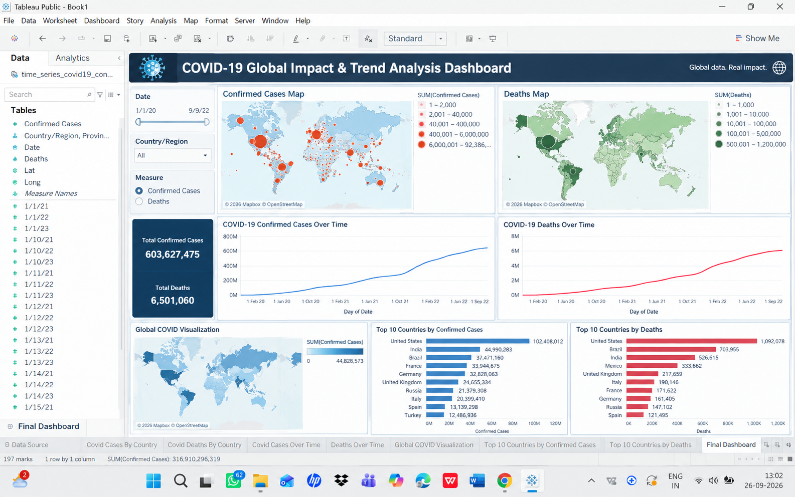
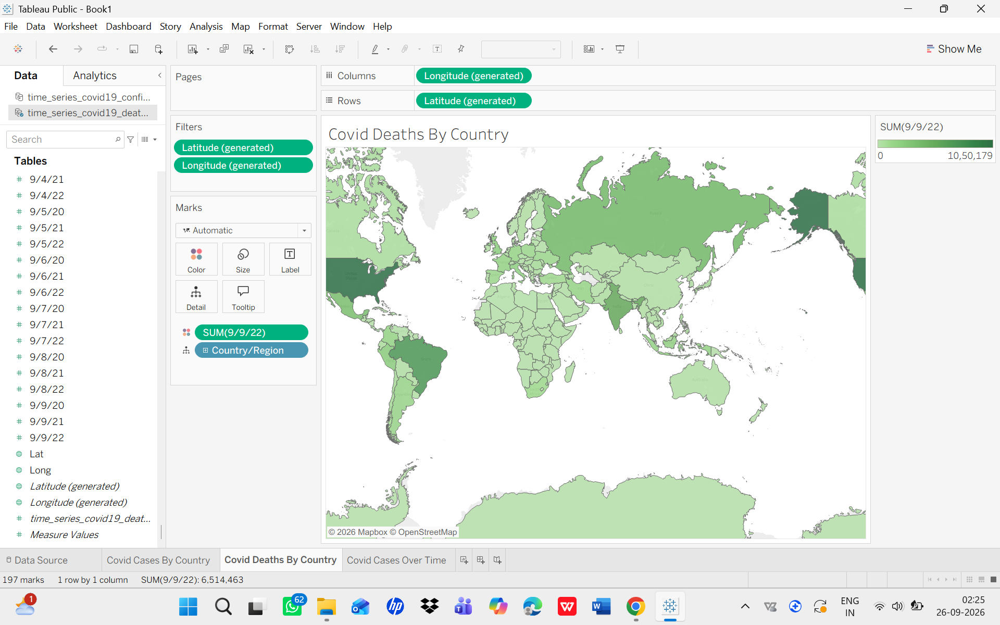
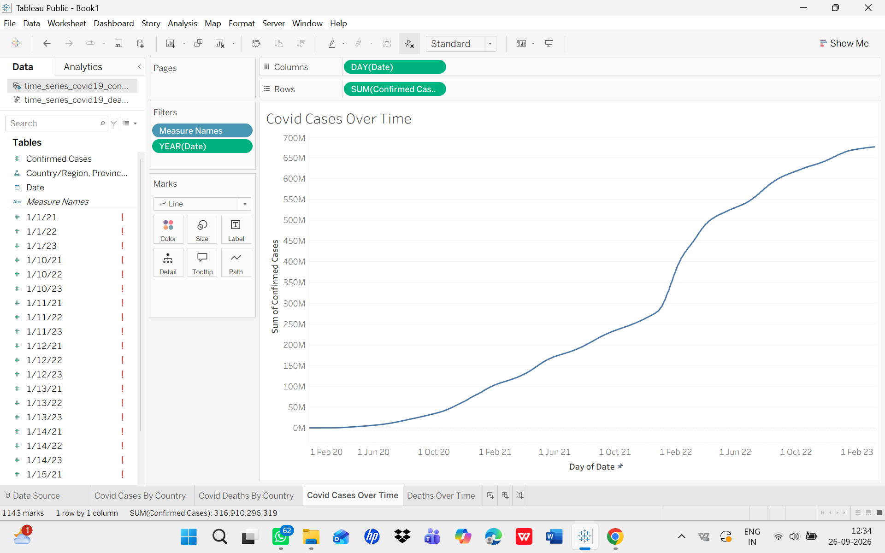
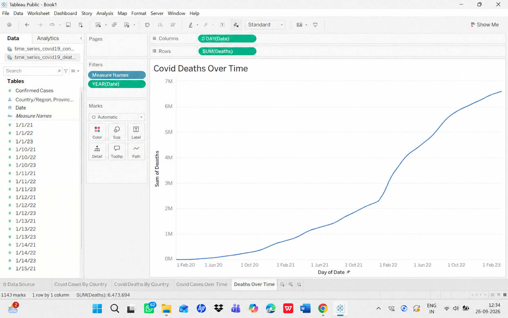
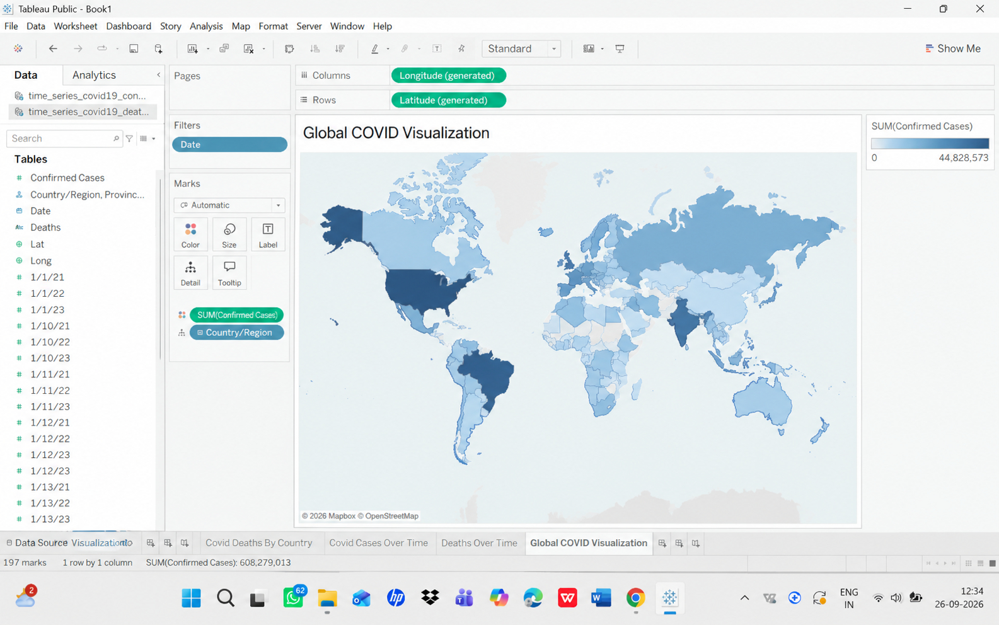
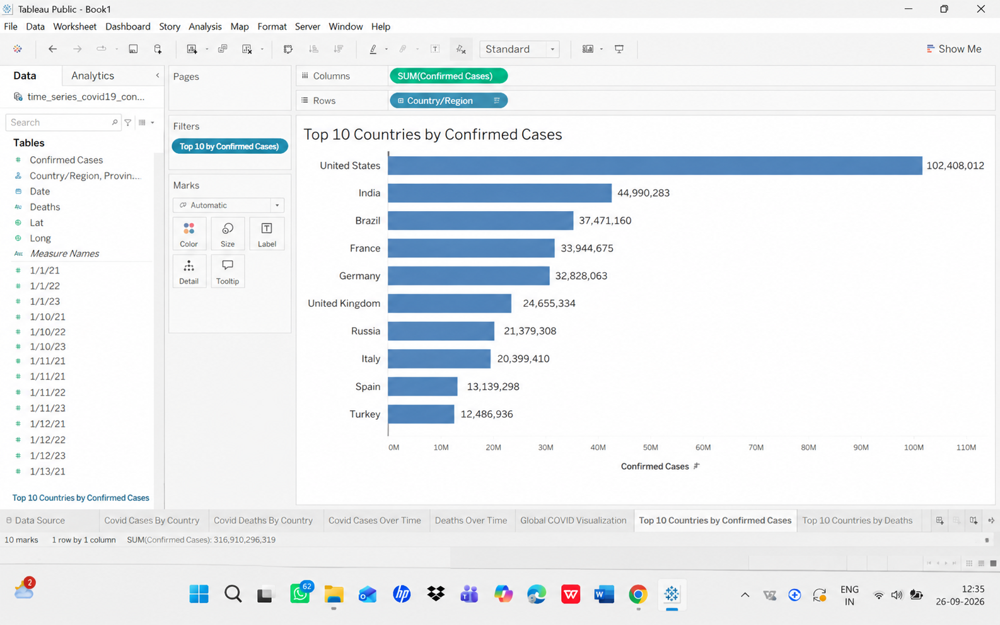
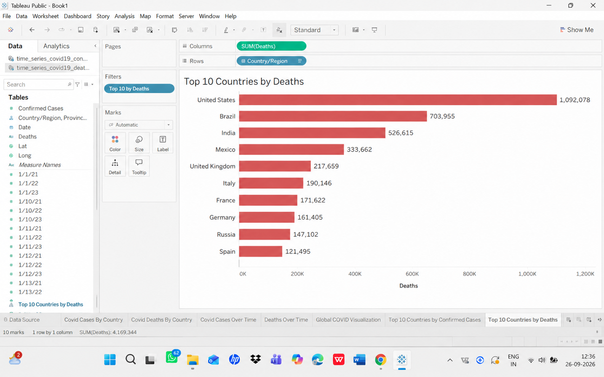

# COVID-19 Global Impact & Trend Analysis

A Tableau-based analysis of global COVID-19 cases, deaths, and trends.

## Dashboard

## Visualizations

### COVID-19 Cases by Country

### COVID-19 Deaths by Country

### COVID-19 Cases Over Time

### COVID-19 Deaths Over Time

### Global COVID-19 Visualization

### Top 10 Countries by Confirmed Cases

### Top 10 Countries by Deaths

